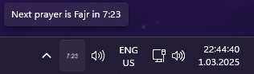

 Time to Pray 
===============

**Time to Pray** is a desktop utility designed to keep you informed about Islamic prayer times. Directly from your system tray, view a real-time countdown to the next prayer. The application proactively retrieves the monthly prayer schedule for your chosen location and caches the data for instantaneous reference. Stay on track with your prayer commitments, knowing the exact time remaining until the next call.

<p align="center">
<br>
  
</p>

Features
--------------------

*   Real-time countdown to the next prayer, accessible from the system tray.
*   Proactively fetches the monthly prayer schedule based on your configured location.
*   Easy-to-access "Settings" dialog for configuring your preferred city and selecting your desired prayer times calculation method.
*   Utilizes PyQt6 for a seamless user interface experience.

Setup & Installation
--------------------

**Using pip (Recommended)**


```bash
pip install time-to-pray
```

After installation, you can run the application with:

```bash
time-to-pray
```

**Manual Installation**

1\.  **Clone the Repository**

```bash
git clone https://github.com/omerbustun/time-to-pray.git
```
```bash
cd time-to-pray
```

2\.  **Install Dependencies**

Make sure you have Python installed. Then, install the required packages:

```bash
pip install -r requirements.txt
```

3\. **Run**

To run the application:


```bash
python src/main.py
```
    

Usage
-----

Once launched, an icon will appear in your system tray. Right-click the icon to access the settings or hover to view the detailed countdown.

Configuration
-------------

The application uses the `settings.json` file for configuration. You can use the "Settings" dialog in the application or manually edit this file (not recommended). The configuration parameters are:

*   `city`: The city you are located in.
*   `country`: The country name or code (e.g., "tr" for Turkey).
*   `latitude` & `longitude`: The geographical coordinates of your location. The application automatically fetches these from the API based on the specified city and country.
*   `method`: The method used to calculate prayer times.

Acknowledgements
----------------

This project utilizes the [`Aladhan API`](https://aladhan.com/prayer-times-api) to fetch prayer times. We are grateful to [Aladhan.com](https://aladhan.com/) for providing this valuable service to the community.

Contributing
------------

Pull requests are welcome. For major changes, please open an issue first to discuss what you would like to change.

License
-------

This project is licensed under the GNU General Public License, version 3 (GPLv3). See the [LICENSE](LICENSE) file for the full license text.